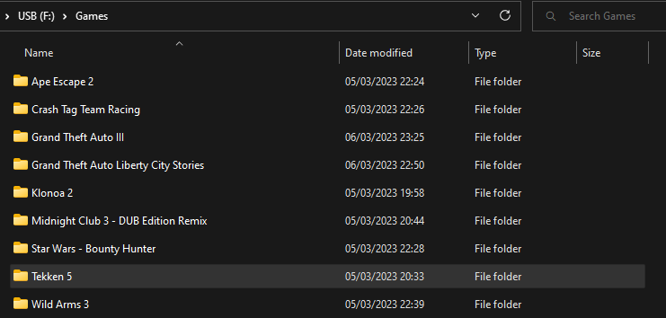
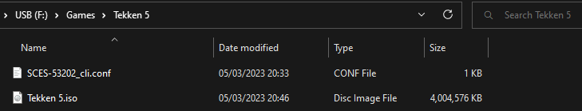

# mast1c0re - PS2 USB Game Loader

Load PS2 ISO games from a USB using the [mast1c0re](https://github.com/McCaulay/mast1c0re) vulnerability.

Requires the [mast1c0re-ps2-network-elf-loader](https://github.com/McCaulay/mast1c0re-ps2-network-elf-loader) game save to load the ELF file.

Currently the copied game is stored temporarily on disk, and is removed once the game is closed. Therefore, it requires you to copy the ISO each time you load the game loader.

## Configuring a USB

The USB drive must be formatted with exFAT and MBR.

The USB root directory should contain a folder named "Games" which contains a single folder for each game, containing a file ending in a ".iso" file extension, and optionally a ".conf" file.

## Config Files

The configuration options can be found on the [PS2 Emulation dev wiki](https://www.psdevwiki.com/ps4/PS2_Emulation#Emulator_Configuration).

A list of existing config files for games can be found on the [PS2 Classics Emulator Compatibility List](https://www.psdevwiki.com/ps4/Talk:PS2_Classics_Emulator_Compatibility_List).

**Note**: Some configuration options cause the game to crash in some cases. The following list of commands have been identified to cause a crash:

* Grand Theft Auto: Liberty City Stories (SLUS_21423)
  * `--gs-h2l-accurate-hash=1`
  * `--gs-adaptive-frameskip=1`
* Wild Arms 3
  * `--ee-static-block-links=JAL,COP2`

See the "Games/" directory for some example configuration files.

## Supported Systems & Firmware Versions
* PS4
  * 5.05
  * 6.72
  * 9.00
  * 10.01
  * 10.50
  * 10.70
  * 10.71